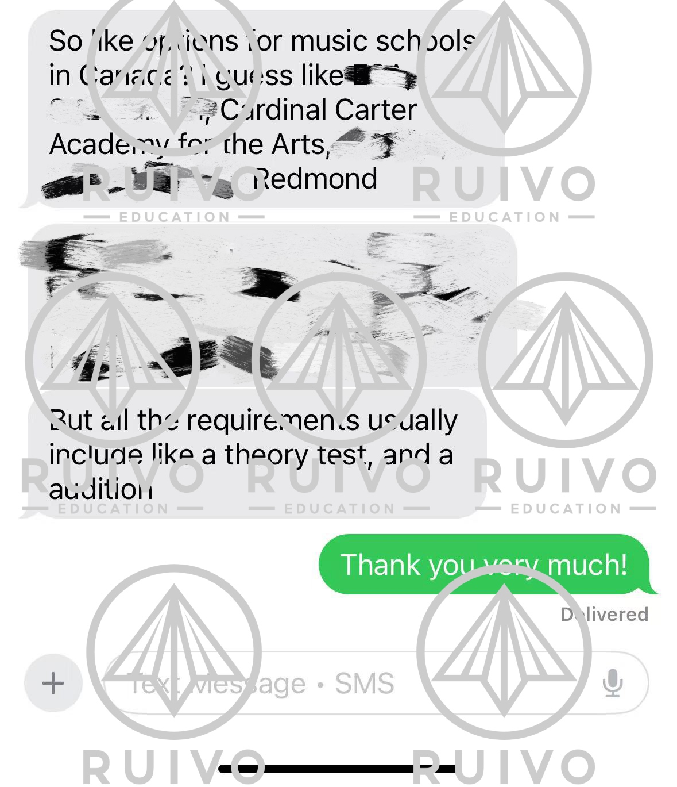
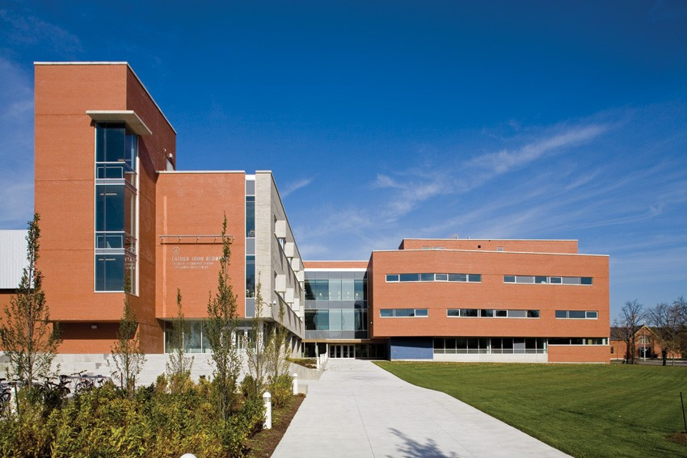
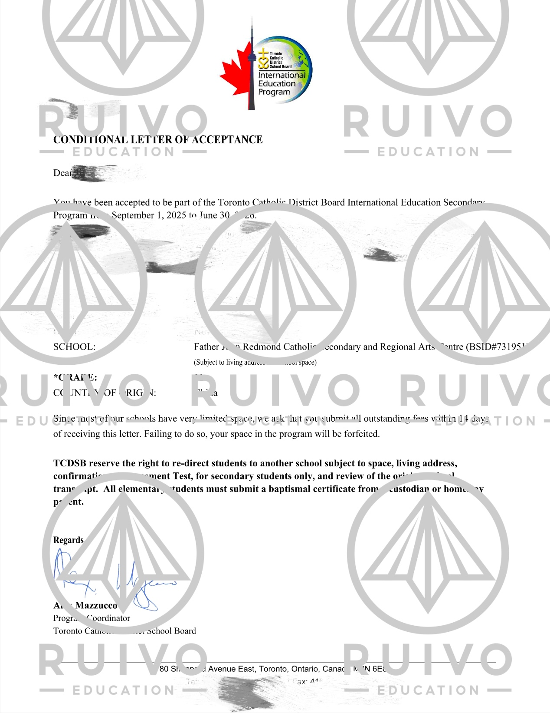
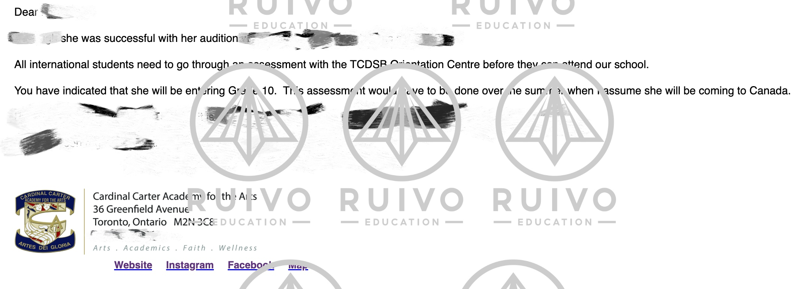
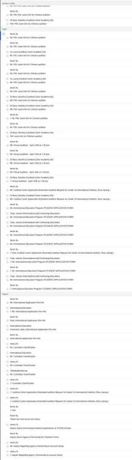

## 🎵 项目背景

> **时间**：2025年3月底
> **地点**：多伦多地区

今年三月底，我们接到了一位同学家长的咨询电话。他们希望为孩子申请加拿大的一所顶级音乐高中，时间紧迫，但父母的期待与孩子的梦想让我们毫不犹豫地出发。

## 🕵️ 深度调研

1. **咨询业内专家**：与多位音乐本科毕业的朋友沟通，盘点多伦多及周边所有优质音乐高中。
2. **筛选目标院校**：重点锁定 **Father John Redmond** 高中与 **Cardinal Carter** 音乐学院。

*图1：与音乐专业朋友的聊天记录截图*

## 🏫 Redmond 高中：一线冲刺

* **挑战**：官网信息不全，电话与邮件均无人响应。
* **行动**：我们团队亲赴校园，与招生负责人面对面沟通。

*图2：Father John Redmond 艺术中心外观*

* **结果**：凭借真诚与专业，成功获得录取通知。

*图3：Redmond 高中录取通知*

## 🎹 Cardinal Carter：远程突围

尽管今年面试名额已截止，我们依然不放弃：

1. **拜访校方高层**：与 Cardinal Carter 音乐学院副校长面谈。
2. **争取机会**：获得特殊的远程面试名额。
3. **技术准备**：配置 VPN、测试网络；
4. **面试排演**：细化问答流程，模拟多种场景。

* **结果**：在充足准备下，学生发挥稳定，成功抓住了这个珍贵的机会。

*图4：Cardinal Carter 高中录取通知*

## 🎉 成果与感言

这一程，充满未知与挑战。感谢学生的配合、家长的信任，以及团队的专业与激情，我们最终突破重围，实现梦想。

> “每一次坚持，都是离目标更近一步。”

## 📎 附件

*图5：与多个学校与和教育局的往来邮件截图*

## ✉️ 联系我们

如果你也有留学申请需求，或在过程中遇到任何困难，欢迎随时与我们联系：

> **Email**: [info@ruivoedu.com](mailto:info@ruivoedu.com)

**#留学申请 #音乐高中 #加拿大留学 #逆袭成功**
